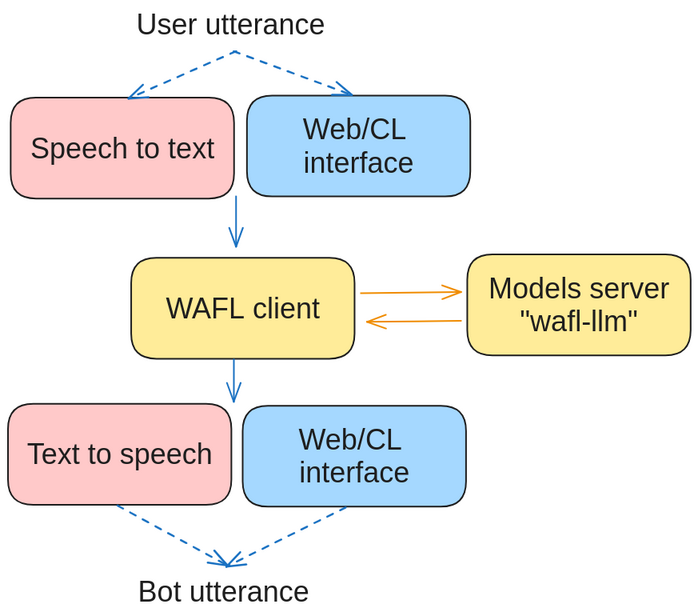

# WAFL-llm 

WAFL is built to run as a two-part system.
Both can be installed on the same machine.
This is the LLM side of the [WAFL project](https://github.com/fractalego/wafl).




## LLM side (needs a GPU)

This part is a server that runs on a machine accessible from the interface side.
This last machine will need to have a GPU to run the Large Language Model at a convenient speed.
This part can be run using a docker image by running the script

```bash
$ docker run -p8080:8080 --env NVIDIA_DISABLE_REQUIRE=1 --gpus all fractalego/wafl-llm:latest
```

or one can clone this repository and run the following

```bash
docker/build.sh
docker run -p8080:8080 --env NVIDIA_DISABLE_REQUIRE=1 --gpus all wafl-llm
```

